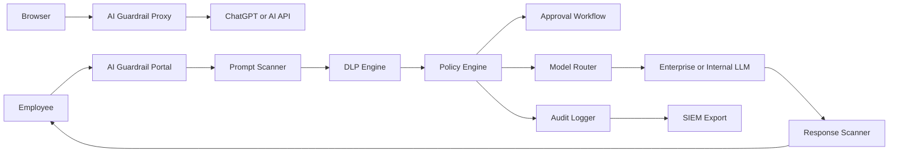

# AI Guardrail

AI Guardrail is an enterprise AI data-loss-prevention project for safe AI adoption. It includes a real-time Chrome/Brave extension for ChatGPT plus a FastAPI/React demo dashboard for audit logs, policy decisions, approvals, and analytics.

The extension blocks sensitive data before it is submitted to ChatGPT. Normal low-risk prompts work as usual. Detection runs locally in the browser and does not send prompt text to an external server.

The proxy mode is the real guardrail path. It runs like Burp Suite or ZAP: browser traffic is routed through a local inspecting proxy, the local CA certificate is trusted for HTTPS inspection, and outbound AI requests or PDF uploads are blocked before they leave the machine when sensitive data is found.

The backend/dashboard implementation is a portfolio-ready local demo. It does not call external LLM providers and does not require API keys. Demo prompts are inspected locally and stored only in the local SQLite database under `data/`, which is ignored by Git.

## Proxy Mode Demo

Proxy mode is the strongest demo for HR or security interviews because it does not depend on ChatGPT page UI selectors. It sits in the network path.

Install dependencies:

```bash
cd /Users/rajbhadrannavar/Documents/AI-Guardrail
python3 -m venv backend/.venv
backend/.venv/bin/pip install -r backend/requirements.txt
chmod +x proxy/run_proxy.sh
```

Start the proxy:

```bash
./proxy/run_proxy.sh
```

Proxy listener: `127.0.0.1:8080`
Proxy web console: http://127.0.0.1:8081

Configure Brave or Chrome:

1. Set HTTP and HTTPS proxy to `127.0.0.1:8080`.
2. Visit http://mitm.it through that proxied browser.
3. Download and install the mitmproxy CA certificate.
4. Open `https://chatgpt.com`.
5. Send a safe prompt. It should work.
6. Send `my api key is 788`. The proxy returns a `403` guardrail block before the request reaches ChatGPT.
7. Upload a PDF. The proxy extracts text from the PDF and blocks the upload if secrets, credentials, regulated data, or confidential terms are found. PDFs that cannot be inspected are blocked by default.
8. Try dynamic credential phrases such as `admin password is xxx`, `admin password as xxx`, `database password is xxx`, `prod api key is abc`, or `bearer token is abc`. They are blocked by the dynamic credential engine.

Audit records are written locally to:

```text
data/proxy_audit.jsonl
```

This is intentionally local-only. Do not install the CA certificate on a machine you do not control.

## PDF Scanner

AI Guardrail scans PDF uploads in two ways:

- Proxy mode: multipart PDF uploads to ChatGPT or AI API hosts are inspected before forwarding.
- Dashboard/API mode: upload a PDF in the `PDF / File Scanner` panel or call the file scan endpoint.

API example:

```bash
curl -F "file=@sample.pdf" "http://localhost:8000/api/guardrail/files/scan?department=Engineering&role=Employee"
```

The scanner extracts text with `pypdf`, applies the same DLP rules as prompt scanning, and blocks uninspectable PDFs.

## Chrome Extension Demo

Load the extension in Chrome or Brave:

1. Open `chrome://extensions`.
2. Enable `Developer mode`.
3. Click `Load unpacked`.
4. Select the `extension/` folder from this repository.
5. Open `https://chatgpt.com`.

Try a normal prompt:

```text
Explain what phishing is in simple terms.
```

It should submit normally.

Try a risky prompt:

```text
My production credential is password=[example-secret-value] and my API key is [example-api-key]
```

The extension should block the submit action and show a local warning banner.

The extension currently detects:

- API keys and OpenAI-style keys
- dynamic phrases such as `admin password is xxx` and `admin password as xxx`
- AWS credentials
- GitHub tokens
- JWT access tokens
- private keys
- passwords and `.env` style secrets
- database connection strings
- payment card numbers
- internal URLs
- high-entropy possible secrets
- lower-risk PII warnings such as email addresses and phone numbers

## Core Capabilities

- Real-time ChatGPT prompt protection with a Chrome/Brave extension
- Burp Suite style local proxy that inspects AI requests in transit
- PDF and text upload scanning before AI provider delivery
- Corporate AI gateway with prompt inspection and simulated model routing
- Sensitive data detection for credentials, tokens, private keys, PII, payment data, internal URLs, source code, contracts, financial reports, medical records, and prompt injection
- Risk classification: Low, Medium, High, Critical
- Policy actions: allow, warn, redact, manager approval, security approval, block
- Redaction preview before routing
- Response inspection before delivery
- Audit logs with user, department, role, timestamp, risk score, action, model route, IP, device, browser, findings, and approval status
- Approval workflow for manager and security review
- Analytics dashboard for blocked, allowed, redacted, department usage, highest-risk users, common secret types, and model usage
- SIEM-ready JSON event endpoint and CSV export
- Enterprise policy and compliance mapping for ISO 27001, SOC 2, NIST CSF, NIST AI RMF, OWASP LLM Top 10, PCI DSS, HIPAA, GDPR, and DPDP Act

## Stack

- Extension: Chrome Manifest V3, content script, local JavaScript scanner
- Proxy: mitmproxy add-on for HTTP/S interception and blocking
- PDF scanning: pypdf extraction plus shared DLP rules
- Frontend: React, Vite, Tailwind CSS, lucide-react
- Backend: FastAPI, Pydantic, SQLite
- Deployment: Docker Compose

## Run With Docker

```bash
docker compose up --build
```

Frontend: http://localhost:5173
Backend API: http://localhost:8000/docs

## Local Development

Backend:

```bash
cd backend
python3 -m venv .venv
source .venv/bin/activate
pip install -r requirements.txt
uvicorn app.main:app --reload
```

Frontend:

```bash
cd frontend
npm install
npm run dev
```

## API Overview

- `POST /api/guardrail/inspect` inspects a prompt and returns a policy decision.
- `POST /api/guardrail/chat` runs the full local gateway flow with response inspection.
- `POST /api/guardrail/response-inspect` inspects a model response.
- `POST /api/guardrail/files/scan` scans a PDF or text upload.
- `GET /api/guardrail/logs` returns audit logs.
- `GET /api/guardrail/logs/export.csv` exports audit logs.
- `GET /api/guardrail/analytics` returns dashboard metrics.
- `GET /api/guardrail/policies` returns sample enterprise policies.
- `POST /api/guardrail/approvals` creates an approval request.
- `GET /api/guardrail/siem/{log_id}` returns a SIEM-normalized event.

## Data Handling

The repository intentionally excludes local data and secrets:

- `.env` and `.env.*`
- local SQLite files under `data/`
- virtual environments
- dependency folders
- build outputs
- Python cache files

Do not commit real employee prompts, customer data, credentials, reports, private keys, or production configuration.

## Architecture



## Production Roadmap

For production, replace demo components with enterprise services:

- PostgreSQL for audit logs, Redis for queues, and object storage for approved files
- SSO with Azure AD, Google OAuth, SAML, or LDAP
- OPA for centralized policy evaluation
- Presidio, spaCy, YARA, and managed DLP services for deeper classification
- Vault or cloud KMS for secrets
- Real OpenAI, Azure OpenAI, Gemini, Claude, Ollama, or internal LLM routing
- Slack, Teams, email, webhook, Splunk, Sentinel, Elastic, QRadar, and Chronicle integrations
- Kubernetes deployment with network policies, ingress, TLS, and persistent storage
