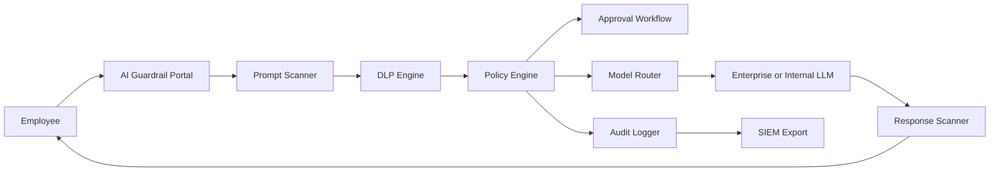

# AI Guardrail

AI Guardrail is an enterprise AI data-loss-prevention project for safe AI adoption. It includes a real-time Chrome/Brave extension for ChatGPT plus a FastAPI/React demo dashboard for audit logs, policy decisions, approvals, and analytics.

The extension blocks sensitive data before it is submitted to ChatGPT. Normal low-risk prompts work as usual. Detection runs locally in the browser and does not send prompt text to an external server.

The backend/dashboard implementation is a portfolio-ready local demo. It does not call external LLM providers and does not require API keys. Demo prompts are inspected locally and stored only in the local SQLite database under `data/`, which is ignored by Git.

## Chrome Extension Demo

Load the extension in Chrome or Brave:

1. Open `chrome://extensions`.
2. Enable `Developer mode`.
3. Click `Load unpacked`.
4. Select the `extension/` folder from this repository.
5. Open `https://chatgpt.com`.

Try a normal prompt:

```text
Explain what phishing is in simple terms.
```

It should submit normally.

Try a risky prompt:

```text
My production credential is password=[example-secret-value] and my API key is [example-api-key]
```

The extension should block the submit action and show a local warning banner.

The extension currently detects:

- API keys and OpenAI-style keys
- AWS credentials
- GitHub tokens
- JWT access tokens
- private keys
- passwords and `.env` style secrets
- database connection strings
- payment card numbers
- internal URLs
- high-entropy possible secrets
- lower-risk PII warnings such as email addresses and phone numbers

## Core Capabilities

- Real-time ChatGPT prompt protection with a Chrome/Brave extension
- Corporate AI gateway with prompt inspection and simulated model routing
- Sensitive data detection for credentials, tokens, private keys, PII, payment data, internal URLs, source code, contracts, financial reports, medical records, and prompt injection
- Risk classification: Low, Medium, High, Critical
- Policy actions: allow, warn, redact, manager approval, security approval, block
- Redaction preview before routing
- Response inspection before delivery
- Audit logs with user, department, role, timestamp, risk score, action, model route, IP, device, browser, findings, and approval status
- Approval workflow for manager and security review
- Analytics dashboard for blocked, allowed, redacted, department usage, highest-risk users, common secret types, and model usage
- SIEM-ready JSON event endpoint and CSV export
- Enterprise policy and compliance mapping for ISO 27001, SOC 2, NIST CSF, NIST AI RMF, OWASP LLM Top 10, PCI DSS, HIPAA, GDPR, and DPDP Act

## Stack

- Extension: Chrome Manifest V3, content script, local JavaScript scanner
- Frontend: React, Vite, Tailwind CSS, lucide-react
- Backend: FastAPI, Pydantic, SQLite
- Deployment: Docker Compose

## Run With Docker

```bash
docker compose up --build
```

Frontend: http://localhost:5173  
Backend API: http://localhost:8000/docs

## Local Development

Backend:

```bash
cd backend
python3 -m venv .venv
source .venv/bin/activate
pip install -r requirements.txt
uvicorn app.main:app --reload
```

Frontend:

```bash
cd frontend
npm install
npm run dev
```

## API Overview

- `POST /api/guardrail/inspect` inspects a prompt and returns a policy decision.
- `POST /api/guardrail/chat` runs the full local gateway flow with response inspection.
- `POST /api/guardrail/response-inspect` inspects a model response.
- `GET /api/guardrail/logs` returns audit logs.
- `GET /api/guardrail/logs/export.csv` exports audit logs.
- `GET /api/guardrail/analytics` returns dashboard metrics.
- `GET /api/guardrail/policies` returns sample enterprise policies.
- `POST /api/guardrail/approvals` creates an approval request.
- `GET /api/guardrail/siem/{log_id}` returns a SIEM-normalized event.

## Data Handling

The repository intentionally excludes local data and secrets:

- `.env` and `.env.*`
- local SQLite files under `data/`
- virtual environments
- dependency folders
- build outputs
- Python cache files

Do not commit real employee prompts, customer data, credentials, reports, private keys, or production configuration.

## Architecture



## Production Roadmap

For production, replace demo components with enterprise services:

- PostgreSQL for audit logs, Redis for queues, and object storage for approved files
- SSO with Azure AD, Google OAuth, SAML, or LDAP
- OPA for centralized policy evaluation
- Presidio, spaCy, YARA, and managed DLP services for deeper classification
- Vault or cloud KMS for secrets
- Real OpenAI, Azure OpenAI, Gemini, Claude, Ollama, or internal LLM routing
- Slack, Teams, email, webhook, Splunk, Sentinel, Elastic, QRadar, and Chronicle integrations
- Kubernetes deployment with network policies, ingress, TLS, and persistent storage
